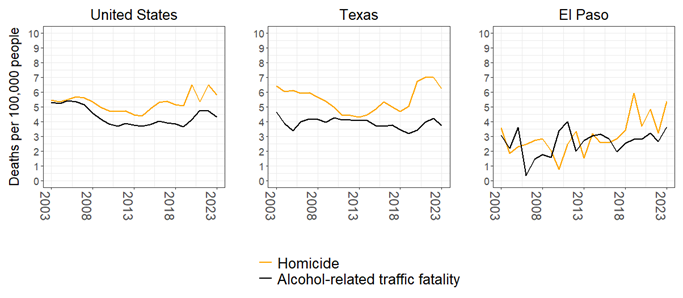
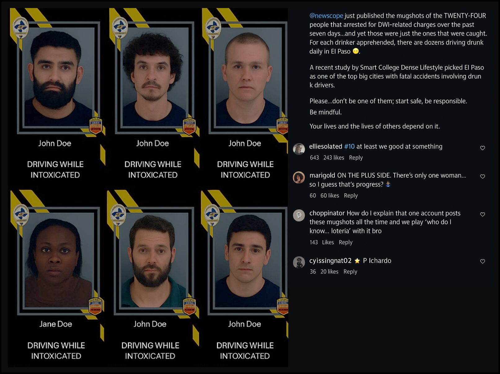
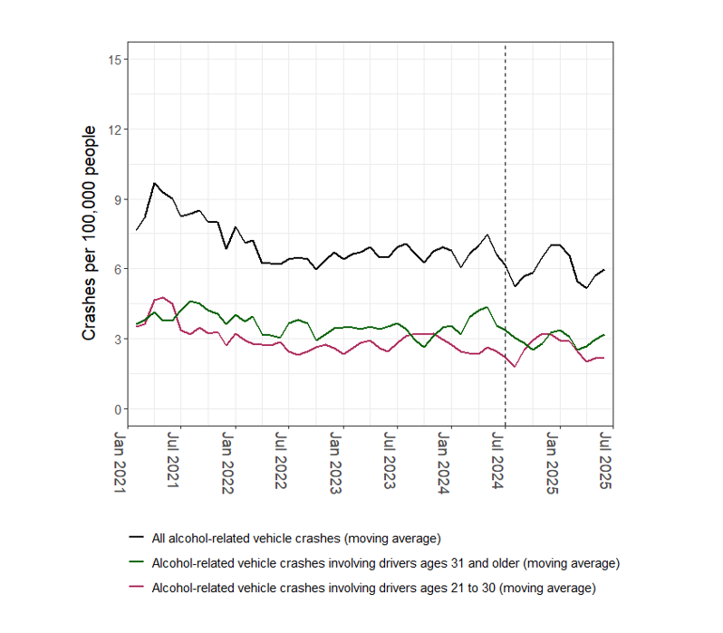
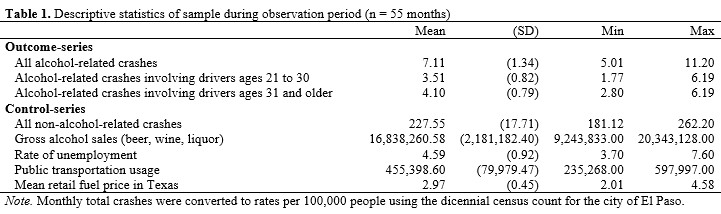
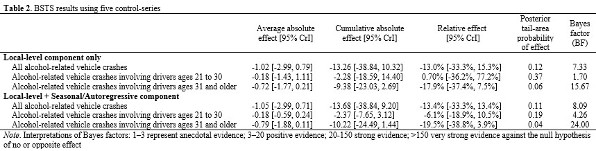
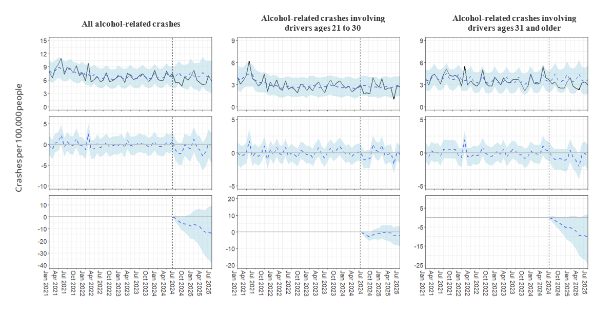
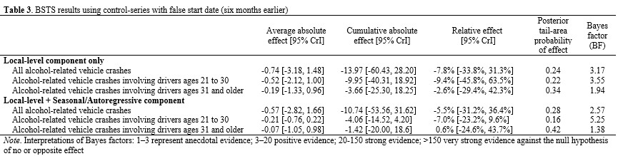
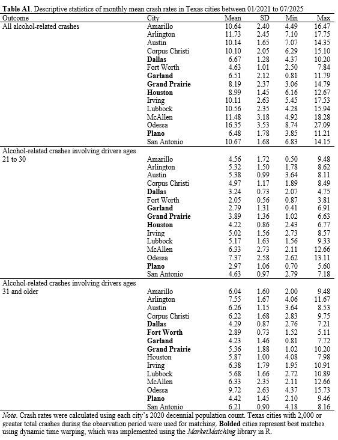
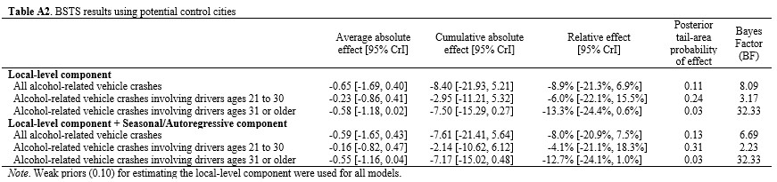

*Disclaimer: This study is under peer-review and subject to revisions following feedback.*

### Introduction

Beginning in the 1980s and continuing through the late 1990s, alcohol-related traffic deaths declined in the United States. The percentage of deaths involving a drunk driver was 48% in 1982 and fell to 30% by 1997, where it has remained for over twenty five years [@nhtsa2023]. Understanding what caused the decline is challenging given the legal and social changes that co-occurred [@williams2006]. Between 1981 to 1986, over 700 laws aimed at drunk driving were introduced, more than 400 citizen groups were founded, and news stories about drunk driving increased fifty-fold [@hingson1988]. As @wagenaar1995 concluded from an attempted meta-analysis: “[its] impossible to distinguish the separate contribution of each intervention” (p. 312). While some evaluations attempted to parse out the effects (e.g., [@west1989]), most studies focused on legal mechanisms, such as lowering blood alcohol concentration (e.g., [@zwerling1999]), and increasing the minimum drinking age (e.g., [@cook1984; @mccornac1982; @williams1983]), to name a few.

This emphasis on formal legal responses has overshadowed the role of community norms and social pressures that also contribute to crime prevention. Exploring community approaches holds particular promise: they align with broader movements encouraging communities to share responsibility for crime control with government [@garland2001; @clear2000], and they may offer new avenues for prevention strategies now that driving while intoxicated (DWI) legislation has largely stabilized nationwide. The current policy environment is therefore well-positioned to estimate the effect of community-based interventions. One avenue is to examine the impact of mass media campaigns on drunk driving, an area of research where most evaluations were conducted more than two decades ago and have yet to include social media campaigns [@elder2004; @tay2005; @yadav2015].

The current study adds to the DWI prevention literature by documenting the impact of a city-wide, social media campaign implemented in a single jurisdiction. Every week for one year, booking photos of people recently arrested for driving while intoxicated (DWI) were shared to social media by a police department and community group. To assess the impact the campaign had on drunk driving, a controlled interrupted time-series design is used to compare the rates of alcohol-involved vehicle crashes before and during the first year of the program. The findings show both the potential for community-based strategies, as well as the potential risks when community groups leverage police practices.

### Prior Research on DWI Prevention

The study of DWI prevention began around the latter half of the 20th century, when quasi-experimental designs debuted in policy evaluation research (e.g., [@berk1983; @campbell1968; @ross1970]). These circumstances gave rise to innovative methods for examining the deterrent effect of legal sanctions where randomization was not possible ([@ross1983; @ross1984; @west1989]). One of the earliest pieces to provide methodological guidance was published by @ross1983 in the journal Accident Analysis & Prevention. The authors reviewed the methods used to evaluate drunk driving interventions and advocated that alcohol-related accidents are a key indicator for measuring drunk driving behavior but failed to capture the entire incidence, what is commonly referred to as the “dark figure” problem in criminal justice research. Although using traffic accidents plausibly underestimates drunk driving, Ross & McCleary argued crash data was most appropriate for prevention evaluations. A similar conclusion was echoed in the Problem-Oriented Policing Guide No. 36 on Drunk Driving, where alcohol-related vehicle crashes were described as one of the key harms that DWI prevention strategies aim to reduce [@scott2006].

Within the transportation literature, a related body of work evaluated the effects of mass media campaigns on drunk driving. Two systematic reviews yielded similar conclusions: that campaigns paired with additional prevention efforts show the strongest reductions in drunk driving outcomes [@elder2004; @tay2005]. The theories of change in this literature lack attention, although the work by Tay & Ozanne (2002) is an exception. Tay & Ozanne discussed the importance of analyzing message content in media campaigns. According to their review, prevention strategies using fear-based content often assume the content arouses fear in viewers and changes behavior; however, this is not always tested in evaluations and may show differential effects across a population (also see @fradella2000).

A glaring challenge in the DWI prevention literature is inferring causal inference given the presence of plausible alternative explanations ([@ross1983]). Indeed, several other factors theoretically influence the rate of traffic accidents in a jurisdiction. With respect to crashes that are alcohol-related, several studies demonstrated that enforcement activity [@ohara2022], public transit usage [@fell2020], fuel price [@chi2011; @naqvi2020], and alcohol sales [@gruenewald1995] are correlated. Given that virtually all city-wide DWI prevention evaluations rely on quasi-experimental designs, the incorporation of these exogenous factors is vital to minimize bias.

### The DWI Friday Initiative

#### Setting 

The setting for the current study is El Paso, the sixth largest city in the state of Texas with a population of 678,815 people in an area of about 257.4 square miles [@uscensus2020]. El Paso is located along the southern border, adjacent to Las Cruces, New Mexico and contains four land ports of entry into Ciudad Juarez, Chihuahua, Mexico. A large military installation is located in the city with a population of 11,260 [@uscensus2020]. As for socioeconomic demographics, the majority of El Pasoans identify as Hispanic (81.25%) and nearly half (47.97%) are adherents of the Catholic Church [@grammich2023]. In 2024, the estimated median household income was $59,932, and the employment rate was 57.9%.

With respect to alcohol-related vehicle crashes, El Paso, like other major cities in Texas, experienced a significant decline in the early 1990s. The rate of traffic fatalities was 17.14 deaths per 100,000 people in 1992 and fell to 8.31 in 2003, decreasing by over 50%.[^1] Since 2003, about one-third of traffic fatalities involve alcohol as a contributing factor. The prevalence of alcohol-related traffic fatalities is nearly as prevalent as homicide in the city and is considered one of the most pressing issues facing the region [@kfox14_2025]. Figure 1 illustrates these trends over a twenty-year period in the United States, state of Texas, and city of El Paso.[^2]

{fig-align="center"}

#### Implementation

On June 21, 2024, the El Paso Police Department (EPPD) began the “DWI Friday” initiative [@luna2024]. Each Friday evening, the EPPD uploaded booking photos of individuals charged with DWI on their official Facebook and Instagram accounts. The individuals featured were all arrested by officers of the department during the week prior to the post. Below each booking photo, the arrestee’s name and alcohol-related charge were displayed. With the exception of Thanksgiving weekend, the EPPD consistently published DWI Friday posts since the initiative began. Over the course of 52 weeks, 1,221 individual photos were shared online.

The coverage and delivery of the campaign circulated through local news outlets but was systematically shared by a local community group recognized throughout the study jurisdiction for its cultural significance and ability to prompt official action [@mata2023; @moorevilla2025]. Each week immediately following the EPPD's posts, all booking photos were obtained and reuploaded to the community group’s Instagram account, which could only be accessed on a computer or mobile device connected to the internet.[^3] Figure 2 provides a rendition of a typical DWI Friday post created by the community group. Upon accessing the post, viewers were presented with 2 x 3 arrangements of booking photos, along with a real-time list of comments made by Instagram users.

{width=250 height=200fig-align="center"}

An important distinction between the EPPD’s practice and the posts by the community social media account is the temporal access of photos and ability for viewers to read comments. The EPPD made arrest photos available for only 24 hours each week and without public commenting, while the community group uploaded photos permanently and facilitated a public forum. This implementation decision significantly increased the level of exposure and determined the context in which viewers would come to interpret the campaign. During the first year, the community group’s posts garnered over half a million user-likes and over 16,000 user-comments. It is important to note not all viewers clicked the “like” button. Given that no data is publicly available to assess the duration and frequency of exposure to the weekly posts, exposure to the initiative is likely underestimated but nevertheless observable using these metrics.

Additionally, the geographic residency of people who viewed the weekly posts is not publicly available, however, evidence from the comments suggests a substantial proportion of users are or were local residents in the study jurisdiction. A representative sample of 474 comments across 51 weekly posts from the community group was dichotomously coded for users who explicitly stated they recognized a person in the arrest photo.[^4] The analysis showed about 10.76% (95% CI: 8.26%, 13.90%) of all comments explicitly state the user recognized a person in the photo (e.g., “Someone I know every week”, “I finally recognize someone!”, “That’s my neighbor”, “Damn, I know three guys on this list”).

In addition to recognizing those who were arrested, users’ comments exhibited a range of reactions to DWI Friday. Some users found the photos and comments entertaining. For example, the top comment in one week’s post contained 111 user-likes: “Literally, the best hour of the week. Here for the comments”. Other users expressed humor, sometimes generally (e.g., 235 user-likes: “yall catch everyone except my ex every week”) or towards specific people in the photos. For instance, the name of an arrested person who appeared to have strabismus (i.e., misalignment of the eyes) appeared in twenty-five comments one week (e.g., 921 user-likes: “I don’t think [Name] could drive sober even if he wanted too”, 438 user-likes: “[Name] didn’t see that coming”). Additionally, some comments drew on a more empathetic tone (e.g., 212 likes: “We’ve all been down in life…we should pray for their recoveries”).

#### Target population

Although the campaign was implemented city-wide, the delivery and timing of DWI Friday posts likely focused exposure to a subset of the population, specifically young adults between the ages 18 to 49 with access to social media. According to estimates from the Pew Research Center, about 76% of Americans between the ages of 18 to 29 use Instagram, followed by 66% of Americans between the ages of 30 to 49 [@pewresearch2024]. The overrepresentation of young adults as Instagram users resembles the overrepresentation of young adults in El Paso who were involved in alcohol-related crashes. A descriptive analysis of crash data shows the average age of drivers in El Paso who crashed with a blood alcohol content over the legal limit was 33.38 years (SD = 12.86) [@txdot2025b]. As for the timing of the initiative, releasing posts during Friday evenings may have impacted decision-making within hours before viewers began drinking and driving, as weekends accounted for 63.57% of all alcohol-related vehicle crashes, and over 85.77% occurred between 6:00 p.m. and 5:00 a.m in 2024 [@txdot2025b].

### Theoretical Framework

Deterrence theory is a reasonable theoretical backdrop for understanding how DWI Friday may prevent would-be offenders from drunk driving. One of the core tenents of crime prevention in the theory is to enhance the severity of consequences. Enhancing consequences is thought to persuade or deter people from engaging in a proscribed behavior. With regards to DWI prevention, prior research suggests the deterrent effect of enhancing legal sanctions is mixed [@evans1991; @mccarthy1987]. An alternative pathway less examined is enhancing the severity of consequences through non-legal mechanisms.

Criminologists Harold Grasmick & Robert Bursik (1990) argued that in addition to the state’s threat of legal punishment, people in community serve as another potential source for deterrence. Grasmick & Bursik termed this source, “significant others”, and defined them as people whose opinions are valued by a would-be offender (e.g., parents, mentors, close friends). If a would-be offender were to violate social norms, including legal ones, “they run the risk of being embarrassed or suffering a loss of respect” from these significant others [@grasmick1990; @grasmick1991, p. 236, emphasis added]. In the parlance of deterrence theory, it is level of perceived embarrassment that enhances the consequences of committing a crime, and thus increases the likelihood of being deterred. The other deterrent mechanism described by the scholars is shame, which, unlike embarrassment, occurs without others present. Shame is a reflective punishment put on by the would-be offender themselves, defined as “a self-imposed sanction [that] occurs when [a person] violates norms they have internalized” (p. 43). According to Grasmick & Bursik, embarrassment and shame both foster the internalization of social norms and weigh into the would-be offender’s decision-making. So long as the perceived consequences outweigh the perceived benefit of committing the crime, the would-be offender is generally deterred.

Grasmick & Bursik’s (1990) general deterrence model closely aligns with other influential theorists during that time. In *Crime, Shame, and Reintegration*, Braithwaite (1989) emphasized the role of shaming as a preferable alternative to coercive legal sanctions, describing it as a “route to freely chosen compliance” (p. 10) [@braithwaite1989]. Unlike Grasmick and Bursik, Braithwaite distinguished between two forms of shaming: disintegrative and reintegrative. Both express social disapproval, but disintegrative shaming focuses on the person, effectively stigmatizing them, whereas reintegrative shaming focuses on the behavior and preserves the offender’s social bonds to society. Another notable contribution comes from Williams and Hawkins (1986), who underscored the critical role of information networks [@williams1986]. They argued that community awareness of a wrongdoing is a necessary precondition for informal social control processes to be activated. Overall, these concepts related to shaming emphasize the role that perceptions and community members have on crime prevention, and they provide an appropriate backdrop for assessing media campaigns that use shame or embarrassment as a method of enhancing punishment.

When applied to DWI Friday, a perceptual deterrence model shows two pathways a person can be generally deterred from drunk driving. The first pathway operates through perceived social consequences of significant others. Upon seeing the post, the would-be offender recognizes that the public dissemination of arrest photos increases the chance that significant others will find out. Significant others—and their perceived disapproval— increase feelings of embarrassment (i.e., enhance the severity of consequences) and thus reduce the likelihood of engaging in drunk driving. The second pathway operates through self-disapproval (i.e., shame). The mere act of viewing the post and comments reinforces the viewer’s sense of law-abiding norms in the community, which eventually become their own. This internalization goes on to foster self-disapproval of the act and may even affect the viewer’s perception of being caught [@piquero1998].

The weekly exposure schedule of DWI Friday is another important feature of the campaign. One possibility is the perceived fear of social consequences and internalization of norms grows stronger with every exposure, thereby moving more people to not drink and drive. The other possibility is the perceived fear of social disapproval eventually “loses its sting” and deters fewer people as time passes. Nagin (1998) called attention to this possibility in his discussion of deterrence effects, theorizing that the novelty or fact that so few are punished is what makes the punishment severe [@nagin1998]. According to Nagin’s logic, any deterrent effect from the campaign would eventually wane over time, as viewers become more desensitized to the perceived consequences.

### Current Study

This study estimates the deterrent effect of the DWI Friday social media campaign on drunk driving. It is important to note that the campaign was not implemented as a randomized experiment. Consequently, any observed reductions in alcohol-related crashes cannot, on their own, be attributed conclusively. To address this limitation, publicly available data on five correlates of alcohol-related vehicle accidents were used. These include gross alcohol sales, public transportation usage, and broader indicators of economic activity.[^5] Integrating these variables into a multi-variate analysis importantly controls for their potential influence, which yields a less biased estimate of the campaign’s effect [@shadish2002].

### Methods

#### Data Sources

To evaluate the campaign, data from several sources were obtained. To assess the incidence of drunk driving, I queried the Texas Department of Transportation’s Crash Records Information System to obtain all vehicle collision records that occurred in the city of El Paso between January 1, 2021 and July 31, 2025. These records represent all reportable vehicle collisions systematically collected by Texas law enforcement agencies.[^6] All records included information such as the time and day a crash occurred, how many vehicles were involved, and the age of the drivers. The remaining sources were used to account for plausibly related measures affecting drunk driving: public transportation usage in the study jurisdiction;[^7] mean monthly retail gasoline prices reported in the state of Texas [@eia2025]; the monthly unemployment rate in El Paso [@bls2025]; and finally, the total gross alcohol sales recorded by the Texas Alcohol Beverage Commission [@tabc2025].

#### Outcome-series

Three outcome-series were analyzed: 
- All alcohol-related vehicle crashes
- Alcohol-related vehicle crashes involving drivers ages 21 to 30 years old
- Alcohol-related crashes involving drivers ages 31 and older

The cutoff of 30 years was based on the age variable’s 50th percentile in the alcohol-related crash data. This ensured there were enough observations each month to model variation and also coincidently reflects the social media usage statistics reported by the Pew Research Center [@pewresearch2024]. Crashes were aggregated to monthly counts and converted into per capita rates of crashes per 100,000 people using decennial census data for the city of El Paso.[^8]

Crashes were defined as alcohol-related if alcohol was flagged as either a contributing or possibly contributing factor. Although vehicle crashes are not direct measurements of drunk driving—because not everyone will crash—they serve as the terminal outcome that DWI prevention strategies seek to reduce [@ross1983; @scott2006]. The rate of traffic fatalities was also considered, specifically those that involved a driver under the influence of alcohol. This outcome was too rare that the lack of variance would not be appropriate for analysis (Range = 0–3, M = 1.08, SD = 0.95). Figure 4 shows the trends of all three outcome-series using nearest-neighbor moving averages.

{fig-align="center"}

#### Control-series

The evidence from prior literature suggests several exogenous factors plausibly affect the rate of alcohol-invovled vehicle crashes. Below are the five control-series used to isolate the campaign’s effect. All control-series were aggregated to the month-level, as not all data were available at smaller units of analysis. Table 1 displays descriptive statistics for all variables in the sample.
- Total riders of public transportation services 
- Mean price of conventional retail fuel in the state of Texas
- Rate of unemployment in El Paso, Texas
- Gross sales of beer, wine, and liquor by licensed establishments in El Paso, Texas
- Total non-alcohol-related vehicle crashes[^9]

{fig-align="center"}

### Analytic Strategy

The sharp introduction of DWI Friday resembles an interrupted time-series, where statistical techniques can be used to estimate changes in the outcome before and after an intervention occurred [@shadish2002]. To account for localized exogenous factors noted in prior literature, this study utilized a controlled interrupted time-series (CITS) design, which incorporated data from several control-series to construct a counterfactual outcome. What follows is a brief overview of Bayesian structural time series (BSTS), the analytic technique used to estimate the causal effect of the campaign. More details on the BSTS framework can be found in @brodersen2015.

BSTS is becoming a popular analytic strategy in criminal justice studies (e.g., @mourtgos2022; @adams2023; @richards2021). BSTS models have several strengths. First, they are adept for assessing how the linear combination of covariates contribute to the temporal evolution of an outcome series. Second, they are modular in that several complex temporal patterns can be modelled simultaneously (e.g., seasonality effects and trends). Third, they estimate effects using a fully Bayesian framework, which provides outputs that are often more intuitive and practical for decision-makers.[^10]

BSTS models are built using a two-level state-space framework consisting of an observation equation and a state equation. The observation equation describes how the observed outcome at each time point is generated from a set of underlying, unobserved components (e.g., local trend, seasonality, and regression effects) plus white noise. The state equation governs how these unobserved components evolve over time. Model parameters and latent states are estimated through their posterior distributions, which represent the uncertainty in each component after combining prior information with the observed data.

For this analysis, the posterior mean is reported, which represents the most probable estimate of the effect. The precision of the effect is assessed by using the standard error of the posterior distribution to compute a 95% credible interval (CrI), which retains an interpretation analogous to confidence intervals in frequentist statistics. For all causal effect estimates, Bayes factors (BFs) are reported to quantify the strength of evidence (see @jeffreys1935). BFs were calculated relative to the null hypothesis of no or opposite effect, as the ratio of posterior odds favoring a positive effect, P(δ > 0), to posterior odds favoring a nonpositive effect, P(δ ≤ 0). Interpretations of BFs follow those proposed by @kass1995: 1–3 represent anecdotal evidence; 3–20 positive evidence; 20–150 strong evidence; and >150 very strong evidence against the null hypothesis of no or opposite effect.

The following equations were used to model the pre-campaign period spanning January 2021 through June 2024 (n = 42 months). Based on these estimates, a counterfactual for the post-campaign period (n = 13) was generated. The full model is specified as follows:

$$
y_t = \mu_t + \gamma_t + \mathbf{x}_t^\top \beta + \varepsilon_t, \quad \varepsilon_t \sim \mathcal{N}(0, \sigma^2)
\tag{1}
$$

$$
\mu_{t+1} = \mu_t + \eta_t, \quad \eta_t \sim \mathcal{N}(0, \sigma_\mu^2)
\tag{2}
$$

where $y_t$ is the monthly rate of alcohol-related crashes at month $t$; $\mu_t$ is the local-level component, capturing slow-moving structural changes over time; $\gamma_t$ is the seasonal component with a seasonal period of 4 months; and $\mathbf{x}_t^\top$ is a vector of control-series predictors with coefficients estimated using spike-and-slab priors (Brodersen et al., 2015).

Preliminary diagnostics of all outcome series revealed statistically significant (p < .05) autocorrelations between lags 1 to 4. Accordingly, a seasonal component with a period of four was used to capture the recurring quarterly structure. The inclusion of a seasonal component improved model fit for all outcomes except those involving drivers ages 21 to 30. For this outcome, an autoregressive component with a lag of 2 was used to model the serial dependency. The results from Augmented Dickey-Fuller tests showed evidence of non-stationarity in the pre-campaign period for all outcomes. This was confirmed by visually inspecting the series shown in Figure 3: an initial decline can be seen between the years 2021 and 2022. This justified the inclusion of a local-level component, which can model such shifts or trends. All model estimations relied on weakly informative prior beliefs and 10,000 Markov Chain Monte Carlo iterations, and convergence was assessed using trace plots and R-hat statistics. To strengthen causal inference, an in-time placebo test was conducted, which estimated the effect had the intervention begun six months earlier [@craig2017].

### Results

Table 2 summarizes the causal effect estimates of the BSTS analyses, and Figure 4 illustrates these results. BSTS analyses were carried out using two model specifications: local-level only and local-level and seasonal/autoregressive. The results from the local-level and seasonal/autoregressive models are presented here to facilitate discussion. Differences between the two are emphasized. 

During the post-campaign period, the observed mean crash rates were 5.98 for all alcohol-related crashes, 2.53 for those involving drivers ages 21 to 30, and 2.97 for those involving drivers ages 31 or older. In contrast, all BSTS models estimated higher counterfactual mean rates for each outcome, respectively, 7.03, 2.72, and 3.75. Expressed as a percentage, these results indicate the DWI Friday campaign is associated with crash reductions ranging from 6.1% to 19.5% across the three outcomes.

The area of the posterior distribution of causal effect estimates equal to or greater than zero is also reported in Table 2. This statistic retains a similar interpretation to p-values in frequentist statistics, where near-zero values or those less than a pre-specified threshold (p < .05) are associated with evidence against the null hypothesis of no or opposite effect. 

Overall, the analysis shows positive evidence that the campaign reduced all alcohol-related crashes (BF = 8.09, mean posterior = -1.05, 95% CrI: [-2.99, 0.71]). Alcohol-related crashes involving drivers ages 21 to 30 also show positive evidence of a reduction (BF = 4.26, mean posterior = -0.18, 95% CrI: [-0.59, 0.24]). The analysis of alcohol-related crashes involving drivers ages 31 and older shows the strongest evidence of a decline (BF = 24.00, mean posterior = -0.78, 95% CrI: [-1.88, 0.11]). It’s important to note that the posterior distribution of estimates for all three outcomes included values greater than zero. When expressed as a percentage in favor of the alternative hypothesis, the analysis shows an 89% probability the campaign caused any reduction for alcohol-related vehicle accidents and about a 96% probability the campaign caused any reduction for alcohol-related vehicle accidents involving drivers ages 31 and older. As for alcohol-related vehicle accidents involving drivers ages 21 to 30, the probability of any reduction is sensitive to model specification: the probability of any reduction is 63% for the local-level only model and increases to 79% when the autoregressive component is added.

{fig-align="center"}

{fig-align="center"}

#### Additional Analyses

To assess the robustness of the BSTS analyses, all models were re-estimated with the campaign period beginning six months earlier (January 2025). These results are presented in Table 3. If the analyses produce similar evidence of reductions, this would suggest alcohol-related vehicle crashes were declining before the campaign began and would potentially explain the observed findings. The results indicate a downward trend was not causing the observed decline for all alcohol-related vehicle accidents and those involving drivers ages 31 and older. The BF values for both of these outcomes decreased across both model specifications. As for alcohol-related vehicle crashes involving drivers ages 21 to 30, the probability of a reduction increased, suggesting the observed decline among this age group was occurring before the DWI Friday campaign began.

{fig-align="left"}

In an effort to account for broader changes in crash patterns, a supplemental analysis was carried out using crash data from 15 Texas cities. Specifically, dynamic time warping, an algorithm for measuring similarity between time-series data (e.g., @eun2021), was used to rank potential control cities for each of the three outcomes in El Paso. Results from these analyses are presented in the Appendix. Overall, the findings mirror the direction and magnitude from the previous analysis. The DWI Friday campaign was associated with a reduction for all alcohol-related vehicle crashes (BF = 6.69, mean posterior = -0.59, 95% CrI: -1.65, 0.43); a reduction in those involving drivers ages 21 to 30 (BF = 2.23, mean posterior = -0.16, 95% CrI: -0.82, 0.47); and a reduction for crashes involving drivers ages 31 and older (BF = 32.33, mean posterior = -0.55, 95% CrI: -1.16, 0.04). Overall, these results continue to suggest the DWI Friday campaign is associated with a deterrent effect, particularly among drivers older than 30 years old.

### Discussion

#### Summary of Findings

This study estimated a social media campaign’s effect on drunk driving in a single jurisdiction. To accomplish this, alcohol-involved crash records were analyzed to identify patterns before the campaign began. These patterns were then used to construct a predicted rate of crashes that could be compared to the observed rate. Subgroup analyses were also carried out on the age of involved drivers to understand if the campaign’s effectiveness varied. To minimize the possibility that other changes in the study jurisdiction could explain the observed results, several records were obtained, specifically usage of public transportation, alcohol sales, and other economic indicators. Before reporting the results, two limitations must be acknowledged.

The first is that the campaign was not implemented under experimental conditions. This problem was handled by incorporating five potential correlates of alcohol-related crashes and conducting falsification tests to account for a pre-existing downward trend. Nevertheless, the possibility stands that an unaccounted change in the study jurisdiction may be misleading the results. The second limitation pertains to the theory of change underlying the campaign. Although social psychologists have demonstrated that public condemnation heightens the experience of humiliation and induces feelings of shame (e.g., @combs2010; @smith2002), this study did not test if these assumptions were met. The results and interpretations that follow must be viewed in light of these limitations.

Overall, the analysis shows DWI Friday is associated with a reduction in alcohol-involved crashes in El Paso, Texas. According to the analysis, an average of 7.13 alcohol-related crashes were prevented each month during the first year of the campaign. Additional analyses were conducted to test whether the population plausibly more exposed to the campaign—drivers ages 21 to 30—was more deterred than older drivers. The analysis found the opposite: there is strong evidence that drivers between the ages of 31 years and older were deterred from drunk driving. For this age group, an average of 5.36 alcohol-related crashes were prevented each month. No definitive evidence of a deterrent effect was found for drivers ages 21 to 30. One possible explanation is that drivers over 30 may have a greater personal stake in complying with the law, as the consequences of an arrest could jeopardize, for instance, their marriage, employment, or personal relationships with others. While the analysis does not fully explain why older drivers appeared more deterred, these differential effects are consistent with arguments by @fradella2000 and @tay2002. Future research should investigate potential mechanisms that explain age-graded responses to shaming sanctions.

#### Policy Implications

The findings of this study carry both theoretical and practical implications for using public shaming to deter drunk driving. The theoretical implication concerns the use of embarrassment or shame for deterrence. Although these mechanisms were not explicitly tested, the informal review of comments suggests the campaign’s intended goal of eliciting embarrassment and encouraging law-abiding attitudes may be, as @maahs2017 observed in a similar study, “drowned out by those belonging to entertainment, emotion, and the joy that people take in the misfortune of others” (p. 56). Such variability offers one explanation for why DWI Friday does not consistently achieve its intended effect: the content must evoke fear, not amusement, for deterrence to occur.

One could imagine modifying the content to meet this objective and hone viewers’ emotional responses. But achieving the kind of stimulus-response pattern envisioned by perceptual deterrence theory—particularly the sense of shame that amounts to “physiological discomfort”, as described by @grasmick1990 (p. 840)—would require pushing the emotional intensity of the campaign much further. In pursuing the deterrence logic here, the ideal stimulus runs the risk of resembling a fictional archetype, such as the Ludovico treatment in *A Clockwork Orange* [@burgess1962] or the daily ritual of Two Minutes Hate in *1984* [@orwell1949]. These characterizations are admittedly extreme and present obvious ethical dilemmas. Beyond attempting to elicit more fear from viewers (i.e., scare them into compliance), attempting to increase the campaign’s effectiveness in this manner raises concerns about its legality.

Arguments surrounding the constitutionality of state officials shaming offenders date back to the Supreme Court’s decision in *Paul v. Davis* (1976), in which the Court ruled that “reputation alone, apart from some more tangible interests such as employment,” is insufficient to trigger procedural protections (emphasis added). This principle is commonly referred to as the stigma-plus factor. In other words, social media campaigns conducted by criminal justice organizations appear to be legally permissible so long as the individuals depicted do not experience tangible losses. What constitutes a tangible loss, however, remains an open question. From this author’s review, one case—*Bursac v. Suozzi* (2008), decided by the New York Supreme Court—found that publicly shaming individuals accused of DWI on the internet can meet the standard of tangible harm.

The constitutional safeguard implied in *Paul v. Davis* (1976) strictly shields citizens from state officials who facilitate shaming punishments, not community groups. In the study jurisdiction, the El Paso Police Department (EPPD) is not shaming these individuals beyond what is expected from a department making public notifications of arrests. The community group, on the other hand, is the entity that shames arrested people by leveraging the EPPD’s social media practice. The implication here may not be the legality, but the inability for the state to regulate and monitor how a community punishes its own members. The EPPD is an institution governed by law and susceptible to systematic change. The community group, in contrast, resembles what Yale law professor James Whitman (1998) described as an “uncontrolled, general populace” (p. 1088), a group governed by evolving standards of morality that regulate how members punish.

As the campaign currently stands, the person accused of DWI faces the risk of formal, regulated punishment should they be found guilty, but they are guaranteed punishment by a community group irrespective of their court outcome. How, or even if, community punishment extends beyond social media is unknown. At best, the weekly punishment ritual of DWI Friday is inconsequential—maybe even beneficial—for the offender’s reintegration, assuming they indeed committed the infraction. The other possibility is the community’s punishment extends beyond reputational harm alone, which is not afforded protection outlined in *Paul v. Davis* (1976). Future research should consider interviewing people who experienced shaming sanctions to learn if the punishment is associated with unintended consequences. Additionally, future research could assess reoffending patterns among those who were shamed, which could speak to whether social media shaming exerts a deterrent effect on recidivism outcomes.

Taken together, these ethical and potential legal implications limit the study of shaming-based interventions like DWI Friday. A promising path forward is to transform disintegrative elements of the campaign into reintegrative forms of shaming, which aim to preserve deterrent effects while minimizing ethical and practical concerns. A notable example is the Canberra RISE drinking and driving experiment, which utilizes reintegrative shaming for drunk driving offenders and has shown positive effects for reducing DWI recidivism [@tyler2007]. Incorporating reintegrative strategies not only allows for safer behavioral change but also enables researchers to conduct rigorous evaluations, helping to fill critical gaps in knowledge on preventing one of the most persistent social problems in the United States.

### Conclusion

This study reported the first-year impact of a social media campaign aimed at deterring drunk driving. Using alcohol-related vehicle crashes as the key outcome measure, the results show the campaign may have deterred drunk driving among drivers aged 31 and older. Drivers aged 21 to 30 showed no consistent evidence of being deterred. While social media shaming may offer some deterrent benefits, these must be balanced against ethical and legal concerns, especially when implemented by community groups without formal oversight. 

## Appendix

{fig-align="center"}
{fig-align="center"}

[^1]: Fatality counts were obtained from archived Motor Vehicle Traffic Accident reports by the Texas Department of Transportation (https://digital.library.unt.edu/explore/collections/).

[^2]: Counts were obtained from Federal Bureau of Investigation (2025), National Highway Traffic Safety Administration (2025), and online reports from the Texas Department of Transportation (2025a). Rates were calculated using linear interpolation of decennial census data.

[^3]: The community social media account is a form of citizen journalism, where any Instagram user can send videos, photos, or messages to the account manager, who then shares the content via a permanent or temporary public post. As of July 2025, the EPPD’s Facebook and Instagram accounts are followed by, respectively, over 85,000 and 39,000 users. The community account currently shows over 600,000 followers.

[^4]: All initial comments (excluding replies) made between June 22, 2024, and July 5, 2025, were collected from 51 DWI Friday posts, resulting in a total of 9,484 comments. Weekly comment counts ranged from 93 to 332 (M = 186.24; SD = 54.50). To ensure fair representation across weeks, a stratified simple random sample with proportional allocation (5%) was drawn from each week, yielding the reported sample size.

[^5]: Enforcement activity, specifically total DWI arrests by the El Paso Police Department, was initially considered but presented an endogeneity problem for this analysis. Presumably, people involved in an alcohol-related crash are subsequently arrested for DWI. This appeared to be the case in this study, which showed monthly alcohol-related crashes and DWI arrests were positively correlated. Analyses not reported here found no substantial differences when DWI arrests were included in the analysis.

[^6]: Under Section 550.026 of the Texas Transportation Code, a vehicle collision is required to be reported to law enforcement if the operator of a vehicle involved is injured, or the damage to a vehicle renders it unable to be normally and safely driven. These reporting requirements can be expanded by municipalities (see Section 550.067 of the Texas Transportation Code), which was the case in the study jurisdiction. According to Chapter 12.16 of the City of El Paso’s Code of Ordinances, drivers involved in an accident in the city of El Paso are required to report it to the police department if damage to the vehicle or property appears to meet or exceed one thousand dollars.

[^7]: Data was obtained from a Freedom of Information Act request filed with the city of El Paso.

[^8]: The results did not differ when using estimates of annual vehicle miles traveled for urban populations (> 5,000 residents) in El Paso County.

[^9]: The inclusion of non-alcohol-related crashes broadly represents exogenous factors not captured in the analysis. For instance, increased usage of rideshare services (e.g., Lyft and Uber) could have plausibly impacted both alcohol-related crashes and all other types of vehicle crashes (e.g., Arif Khan et al., 2022).

[^10]: Under a frequentist approach, a significance test below the 5% alpha level is interpreted to mean that, assuming the null hypothesis of no effect is true, there is a 5% probability of obtaining a result at least as extreme as the one observed. Bayesian analyses can be set up to yield similar inferential statements, but they offer greater flexibility by allowing decision-makers to focus directly on probabilities tied to their interest. Rather than thinking in the dichotomous terms required by the Fisher–Neyman framework of statistical significance, a police chief or city official might instead want to know the probability an intervention produced at least a 10% reduction (for guidance on applying Bayesian analyses to policy-decisions, see Mourtgos, 2025).

