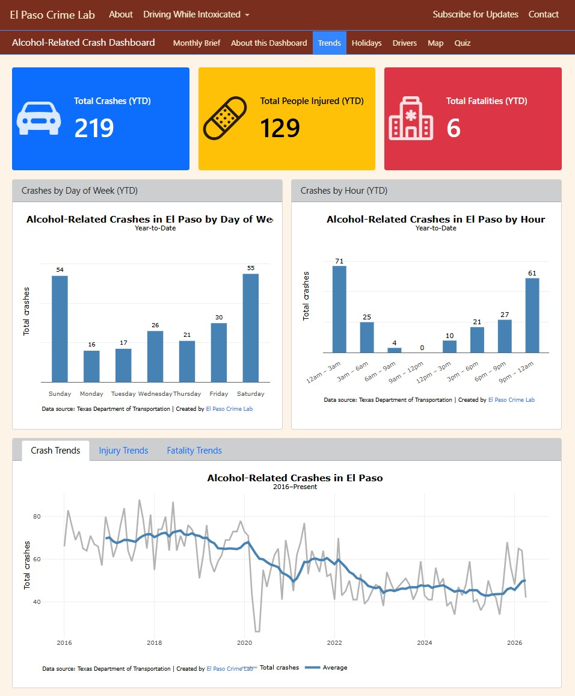
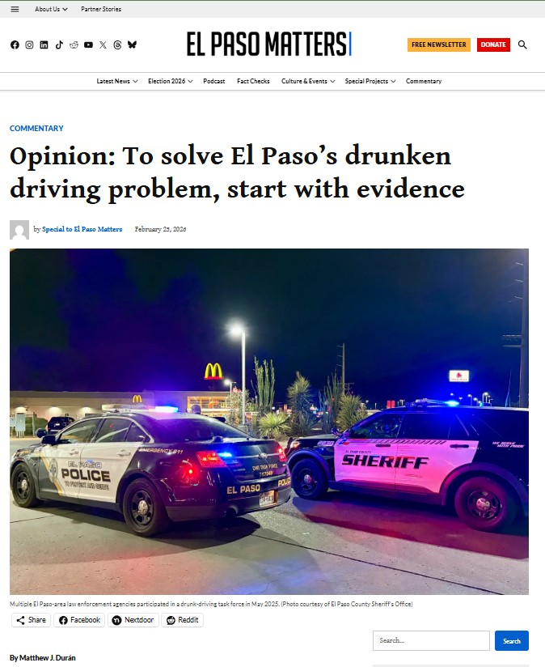

This webpage shares research, data, and local reporting related to alcohol-impaired driving in El Paso. It includes a public dashboard, research studies, reports, news tracking, and ongoing projects that help explain how impaired driving affects the community.

## Alcohol-Related Crash Dashboard

::: {.project-block}
::: {.grid .align-items-center}

::: {.g-col-12 .g-col-md-6}

**Overview:**  
The Alcohol-Related Crash Dashboard is a publicly available tool designed to monitor alcohol-related crashes in El Paso. It includes over 30 data points covering crash trends, geographic patterns, driver, and vehicle characteristics. The dashboard is updated monthly, enabling near real-time monitoring of impaired driving in the city.

 

<a href="crash_dashboard.html" target="_blank" class="btn btn-primary">
View Dashboard
</a>

:::

::: {.g-col-12 .g-col-md-6}

:::
:::
:::

---

## Study: Does Public Shaming Deter Drunk Driving?

::: {.project-block}
::: {.grid .align-items-center}

::: {.g-col-12 .g-col-md-6}

**Summary:**  
This study evaluates the impact of a social media campaign in El Paso that publicly shared booking photos of individuals arrested for driving while intoxicated. Using alcohol-related vehicle crashes as the key outcome measure, the results show the campaign may have deterred drunk driving among drivers aged 31 and older. Drivers aged 21 to 30 showed no consistent evidence of being deterred. While social media shaming may offer some deterrent benefits, these must be balanced against ethical and legal concerns, especially when implemented by community groups operating without formal oversight. 

 

<a href="dwi_friday_study.html" class="btn btn-primary">
Read Paper
</a>

:::

::: {.g-col-12 .g-col-md-6}

:::
:::
:::

---

## In the Media

::: {.project-block}
::: {.grid .align-items-center}

::: {.g-col-12 .g-col-md-6}

**Opinion Article:**  
This article explores why arrest data can be misleading when trying to understand drunk driving trends, and why researchers often rely on alcohol-involved crash rates instead. This article also includes a graph comparing the rate of alcohol-involved crashes in El Paso to other Texas cities.

 

<a href="https://elpasomatters.org/2026/02/25/opinion-why-el-paso-needs-better-data-to-solve-drunk-driving-problem/" target="_blank" class="btn btn-primary">
Read Article
</a>

:::

::: {.g-col-12 .g-col-md-6}

:::
:::
:::

---

## Local Research on Impaired Driving

::: {.project-block}
::: {.grid .align-items-center}

::: {.g-col-12 .g-col-md-6}

**Summary:**  
A comprehensive review of all local research on impaired driving in El Paso is underway. This review will document what is known and reveal critical gaps—informing a clear path forward for research, policy, and prevention.

 

<a href="dwi_protocol.html" target="_blank" class="btn btn-primary">
Read the Search and Analysis Protocol
</a>

:::

::: {.g-col-12 .g-col-md-6}

:::
:::
:::

## Latest News on DWI in El Paso

::: {.news-block}

This page tracks the latest developments on impaired driving in El Paso. It brings together recent reporting on crashes, arrests, enforcement activity, and policy changes so you can quickly see what’s happening across the city.

 

<a href="dwi_news.html" target="_blank" class="btn btn-primary">
View Latest News
</a>

:::

