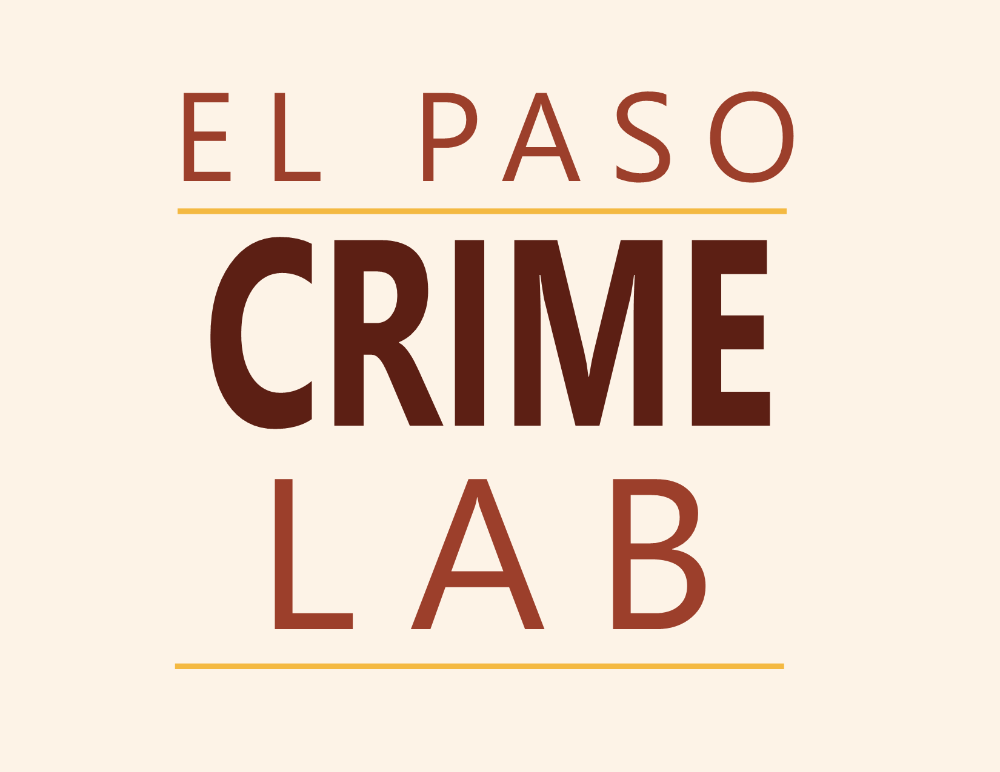

  

## About Us

The El Paso Crime Lab is an independent research and data initiative that provides analytical services, data products, and evidence-based insights on crime and public safety in the El Paso region.

We engage in a range of applied research activities, including:

- **Survey development and analysis**  
  Designing, administering, and analyzing surveys to better understand community experiences, perceptions of safety, and underreported dimensions of crime.

- **Program and policy evaluation**  
  Assessing the impact of interventions, enforcement strategies, and public policies using quasi-experimental and statistical methods.

- **Crime data analysis and visualization**  
  Identifying trends and patterns in crime and public safety outcomes using administrative and observational data.

- **Report and policy brief production**  
  Translating research findings into clear, actionable summaries for stakeholders and community partners.

- **Data integration and management**  
  Combining data from multiple sources to support comprehensive analyses of crime and related social outcomes.

---

## Open Access Mission

A central goal of the El Paso Crime Lab is transparency. By making data and research publicly accessible, the Lab promotes open dialogue and supports evidence-based approaches to criminal justice policy. This work helps bridge the gap between academic research and real-world decision-making in the El Paso community.

---

## Contact Information

The El Paso Crime Lab is operated by Open Criminology Research, a Texas limited liability company. It is not affiliated with the Texas Department of Public Safety or any law enforcement agency.

For questions, data requests, or collaboration opportunities, please contact:

Matthew J. Durán

email: [mduran29@asu.edu](mailto:mduran29@asu.edu)  
website: [https://mattduran12.github.io](https://mattduran12.github.io)