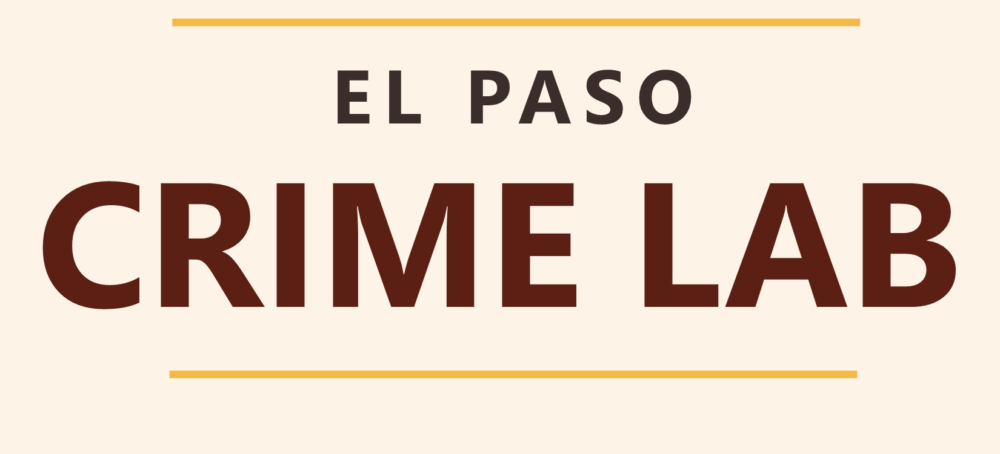

<!-- ============================================================
     HERO
     ============================================================ -->

<h1>
Evidence. Research. Public Safety.
</h1>

Independent research on crime and public safety in the borderland.

<a
  href="dwi_home.html"
  class="hero-button primary"
>
Explore Our Research →
</a>

<a
  href="contact.html"
  class="hero-button secondary"
>
Contact Us
</a>

<!-- ============================================================
     MISSION
     ============================================================ -->

Our Mission

The El Paso Crime Lab is an independent research organization focused on crime and public safety in the El Paso region. We produce evidence-based research that increases community capacity to diagnose, understand, and respond to criminal justice-related issues.

<!-- ============================================================
     WHAT WE DO
     ============================================================ -->

<h2>
What We Do
</h2>

01

<h3>
Research
</h3>

Conduct independent research examining crime, public safety, and criminal justice issues affecting the El Paso region.

<a
  href="dwi_home.html"
  class="area-link"
>
Explore research →
</a>

02

<h3>
Training & Technical Assistance
</h3>

Collaborate with local government and non-government organizations to build dashboards or intelligence products that help communities monitor local problems and understand what the data show.

<a
  href="crash_dashboard.html"
  class="area-link"
>
View the data →
</a>

03

<h3>
Community Resources
</h3>

Connect residents and families with organizations and services available throughout the El Paso community.

<a
  href="dwi_services.html"
  class="area-link"
>
Find resources →
</a>

<!-- ============================================================
     FEATURE
     ============================================================ -->

Current Research

<h2>
Understanding impaired driving in El Paso
</h2>

Our current research examines alcohol-impaired driving using local crash data, research evidence, and community information. Explore the dashboard, reports, studies, and local reporting.

<a
  href="dwi_home.html"
  class="feature-action"
>
Explore the DWI Research Hub →
</a>

Local problems require local evidence.
  
We focus on producing research that can be understood and used by the communities it describes.

<!-- ============================================================
     CONNECT
     ============================================================ -->

<h2>
Stay Connected
</h2>

Follow our work, receive updates about new research, or get in touch.

<a
  href="subscribe.html"
  class="connect-link"
>
Email Updates
</a>

<a
  href="contact.html"
  class="connect-link"
>
Contact
</a>

<a
  href="https://www.instagram.com/epcrimelab/"
  target="_blank"
  class="connect-link"
>
Instagram
</a>

<a
  href="dwi_home.html"
  class="connect-link"
>
Research
</a>

